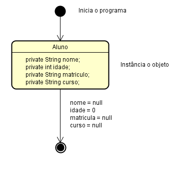
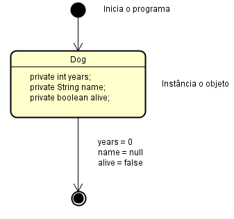
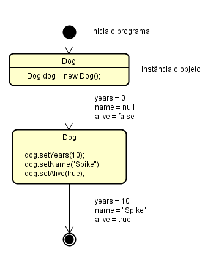

# Introdução a OO

### Lista de Exercícios sobre Orientação a Objetos - 1ºB BES2019

Utilizar os onhecimentos de orientação a objetos para resolver os problemas solicitados.

 - Problema 01
   - Um objeto é qualquer coisa que representa algo do mundo real.  
 
 - Problema 02
   - Caracteristicas: Ano, Modelo, Cavalos.
   - Metódos: TrocarMarcha, Ligar, Acelerar.
 
 - Problema 03
   - Caracteristicas são os Atríbutos.
   - Comportamento são os Métodos.
 
 - Problema 04
   - Diminuir a complexidade da programação, possibilitando a reutilização do código. Utilizando objetos para se comunicarem entre sí,
   para a construção do software de maneira cooperativa.
 
 - Problema 05
   - Abstração é dar foco somente a aquilo que é realmente importante, em OOP, abstrair é o ato de definir o que é importante p/ ser 
   usado em uma classe. Por exemplo ao tratar de uma conta bancaria, saber o que é importante extrair disso, num contexto de banco não é
   interessante saber o tipo sanguineo do cliente, já se tratando de um sistema de banco de sangue, é algo relevante.
 
 - Problema 06
   - Uma classe é uma estrutura de dados que busca representar um objeto, no qual compreende as características e comportamentos daquele 
   objeto.
 
 - Problema 07
   - Utilizar uma palavra, começando sempre com uma letra maiúscula, sempre que houver outra palavra, deve iniciar com letra maiúsucla
   tambem, não usando espaço, nem iniciando a variavel com número, no singular. Padrão camelCase. Ex: Carro, CarroEletrico.
 
 - Problema 08
   - 4. CarroEletrico.
 
 - Problema 09
   - Utilizar uma palavra, começando sempre com uma letra minuscula, sempre que houver outra palavra, deve iniciar com letra maiúsucla
   tambem, não usando espaço, nem iniciando a variavel com número, podendo iniciar com $ ou _ (underscore), mas não é o recomendado. 
   Padrão camelCase. Ex: corDoCabelo.
 
 - Problema 10
   - 3. corDeFundo.
 
 - Problema 11
   - Utilizar uma palavra, começando sempre com uma letra minusculo, sempre que houver outra palavra, deve iniciar com letra maiúsucla
   tambem, não usando espaço, nem iniciando a variavel com número, comumente sendo um verbo. Padrão camelCase. Ex: getCorDoCabelo.
 
 - Problema 12
   - 1. estaVazio
 
 - Problema 13
   - Objeto é uma referência de memória para a instância de uma classe.
   Ela passa a existir a partir do momento que é instânciado na memória.
   Deixando de existir quando o programa é encerrado.
 
 - Problema 14
   - O Objetivo do operador new é criar uma nova instância na memória para aquela classe.
 
 - Problema 15
   - Um construtor é um "método" utilizado para inicializar os atríbutos da classe.
   Seu nome deve ser o mesmo da classe. Ex: 
 ```java
 public class Pessoa{
 
     public Pessoa(){}
     
 }
 ...
 Pessoa p = new Pessoa(); 
 ```
 
 - Problema 16
   - Sera o construtor padrão que o Java implementa. Ex:
 ```java
 public Pessoa{
 }
 ```
 
 - Problema 17
 ```java
 Pessoa p = new Pessoa(); 
 ```
 
 - Problema 18
   - É a capacidade de não expor o funcionamento do objeto, ou seja, somente a própria classe precisa saber como é seu funcionamento.
   Os outros objetos que iram se comunicar com ela não precisam saber como funcionam seus métodos.
 
 - Problema 19
   - Fazer com que o método ou atributo seja acessado por qualquer outro objeto ou de forma direta.
 
 - Problema 20
   - Fazer com que o método ou atributo seja acessado somente pela própria classe.
 
 - Problema 21
   - O encapsulamento em uma classe irá definir de que forma será possivel acessar um atributo. Se um atributo for privado, só será
   possivel acessar utilizando os métodos da própria classe, caso seja público poderá ser acessada de forma direta.
 ```java
 public class Aluno{
    private String matricula;
    
    public String getMatricula(){
        return this.matricula;
    }
    
    public void setMatricula(String matricula){
        this.matricula = matricula;
    }
 }
 ```
 
 - Problema 22
   - Quando o encapsulamento torna um atributo da classe privado, para acessar o valor deste atributo utilizamos um método getter.
 ```java
 public class Aluno{
    private String matricula;
    
    public String getMatricula(){
       return this.matricula;
    }
    
    ...
 }
 ```
 
 - Problema 23
   - Quando o encapsulamento torna um atributo da classe privado, para definir o valor deste atributo utilizamos um método setter.
 ```java
 public class Aluno{
    private String matricula;
    
    public void setMatricula(String matricula){
        this.matricula = matricula;
    }
    ...
 }
 ```
 
 - Problema 24
   - 1 - Classe, 2- Atributos, 3 - Métodos
 
 - Problema 25
   - Definir o modificador, sendo +(public), -(private), #(protect), ~(default). O nome do atributo (seguindo o padrão da linguagem) : e 
   o tipo. Ex: - nome: String.

 - Problema 26
   - modificador nomeDoMetodo(parametro: TipoParametro): TipoRetorno
   Ex: +getSaldo(): double
 
 - Problema 27
   - Utilizando o termo << create >> antes do metodo que leva o mesmo nome da clas.
   - Ex: << create >>+Carro(marca:String, modelo: String, ano: int)
 
 - Problema 28
 
 | Modificador | Tipo de Acesso |
 |-------------|----------------|
 |     +       |    (public)    |
 |     -       |    (private)   |
 |     #       |    (protect)   |
 |     ~       |    (default)   |
 
 - Problema 29
 
 | Cliente                     |
 |-----------------------------|
 | -nome:  String              |
 | -email: String              |
 | -telefone: int              |
 | |
 | +getNome(): String          |
 | +setNome(nome: String)      |
 | +getEmail(): String         |
 | +setEmail(email: String)    |
 | +getTelefone(): int         |
 | +setTelefone(telefone: int) |
 
 - Problema 30
 
 ```java
 public class Cliente{
     private String nome;
     private String email;
     private int telefone;
  
     public String getNome(){
         return this.nome;
     }
     
     public void setNome(String nome){
         this.nome = nome; 
     }
        
     public String getEmail(){
         return this.email;
     }

     public void setEmail(String email){
         this.email = email; 
     }
        
     public String getTelefone(){
         return this.telefone;
     }

     public void setTelefone(String telefone){
         this.telefone = telefone; 
     }
    }
 ```
 
 - Problema 31
 
 ```java
 
    public class Produto{
 
        private String nome;
     
        public String getNome(){
            return this.nome;
        }
     
        public void setNome(String nome){
            this.nome = nome; 
        }
    }
    
    public class Password{
 
        private String value;
     
        public void Password(String value){
        }
     
        public boolean isEqual(Password p){
        }
    }
    
    public class Animal{
        
        private boolean alive;
        
        public boolean isAlive(){
        }
        
        private void die(){
        }
    }
 ```
 
 - Problema 32
 
 |         Livro          |         ContaCorrente         |      Par       |           Impressora            |
 |------------------------|-------------------------------|----------------|---------------------------------|
 | -nome: String          | -saldo: double                | +chave: String |                                 |
 | -telefone: int         |                               | +valor: String |                                 |
 | | | | |
 | +getNome(): String     | +sacar(valor: double): double |                | +imprimir(documento: Documento) |
 | +setNome(nome: String) | +depositar(valor: double)     |                |                                 |
 |                        | -recalcularSaldo()            |                |                                 |
 
 - Problema 33
   - O estado de um objeto é os valores que seus atributos possuem no momento. 
 
 
 - Problema 34
 
 ```java
 diagram de objetos
 public class Dog(){
     int = 0
     String = null
     boolean = false
 ```
 
 - Problema 35
 
 ```java
 diagram de objetos
 public class Dog(){
     Years int = 10
     name String = "Spike"
     alive boolean = true
 ```
 
 - Problema 36
 
 ```java
 diagram de objetos
 public class pug(){
     idade int = 2
     nome String ="Spoke"
     vivo boolean = true
     
 public class buldog(){
     idade int = 0
     nome String ="Spike"
     vivo boolean = false
 ```
 
 - Problema 37
 
   No código abaixo, existem algums problemas, tais como:
   - O atributo weight estar como public, isso torna os métodos getWeight e setWeight inuteis, permitindo o acesso direto ao atributo.
   - No método main, após instânciar o objeto, o atributo name é acessado de forma direta, o que não é possivel, pois seu modificador é
     privado.
     
 ```java
 public class Cat{
     private String name;
     public double weight;
     // Getters e Setters suprimidos
 }
 
 public class Main{
     public static void main(String args[]){
         
         Cat c = new Cat();
         c.weight = 3.5;
         c.name   = "BlackCat";
     }
 }
 ```
 
  As possiveis correções seriam:
  - 
   - Tornar os atributos todos privados;
   - utilizar os setters para modificar o estado dos atributos do objeto.
  
```java
public class Cat{

    private String name;
    private double weight;
    // Getters e Setters suprimidos
}

public class Main{

    public statis void main(String args[]){
    
        Cat c = new Cat();
        
        c.setWeight(3.5);
        c.setName("BlackCat");
    }
}
